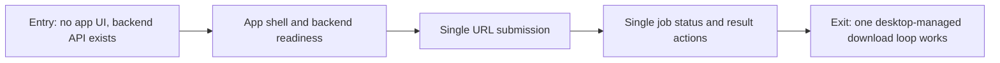

# Phase Contract: Phase 1 - Desktop App Starts One Download

**Date**: 2026-05-08
**Feature**: windows-desktop-downloader-ui
**Phase Plan Reference**: `history/windows-desktop-downloader-ui/phase-plan.md`
**Based on**:
- `history/windows-desktop-downloader-ui/CONTEXT.md`
- `history/windows-desktop-downloader-ui/discovery.md`
- `history/windows-desktop-downloader-ui/approach.md`

---

## 1. What This Phase Changes

After this phase, the user can open a Windows desktop app, wait for the app-managed downloader backend to become ready, paste one in-scope Douyin URL, start the download, watch a friendly status surface, and open the selected output folder when the job finishes. The app does not require the user to start `python run.py --serve` manually or open a browser-localhost UI.

This is the first believable slice because it proves the product boundary that all later work depends on: desktop shell, backend lifecycle, backend health, app-to-backend job submission, status polling, and result actions.

---

## 2. Why This Phase Exists Now

- It is first because D1 and D15 are structural: the app must be a Windows desktop app and must manage the downloader backend in the background.
- Batch, cookie recovery, persisted history, and portable packaging are all riskier if the single managed-backend download path is not already proven.
- This phase intentionally keeps batch and advanced recovery out of execution so workers can focus on one complete loop without mixing every first-version requirement into the first slice.

---

## 3. Entry State

- `douyin-downloader-app` has Khuym workflow scaffolding but no implemented desktop app.
- The sibling backend repo `F:\Work\DouyinDownload\douyin-downloader` has a FastAPI server with `/api/v1/health`, `/api/v1/download`, `/api/v1/jobs/{job_id}`, and `/api/v1/jobs`.
- Existing server jobs are single-URL, async, in-memory, and expose status plus total/success/failed/skipped counts.
- Existing backend server mode is manually started today through `python run.py --serve --serve-port <port>`.
- The Phase 1 plan is approved, but execution has not been validated yet.

---

## 4. Exit State

- A Tauri Windows desktop app scaffold exists in `douyin-downloader-app` with a clean utility UI suitable for a restrained Windows downloader.
- The app starts or attaches to a managed local backend process, waits for `/api/v1/health`, shows ready/error state, and captures backend diagnostics separately from the main download surface.
- The user can select or keep one output folder for the current session, and the backend job uses that folder through generated config or an equivalent validated app-to-backend contract.
- The Single mode surface accepts one in-scope URL, submits it to the backend, polls job status, and shows active job, status, total/success/failed/skipped counts, and friendly failure text.
- After a terminal job state, the UI exposes a practical action to open the output folder.
- Automated tests cover the public behavior for backend lifecycle/client state, single job submission/polling, and UI status transitions using fakes or test clients; no tests require real Douyin network calls.
- A manual/dev UAT path proves the app can open and complete the single-download flow against the existing backend or a documented fake backend when real credentials/cookies are unavailable.

---

## 5. Demo Walkthrough

A user launches the Windows desktop app. The app shows that the backend is starting, then ready. The user chooses an output folder, pastes one Douyin video or note URL, starts the download, sees pending/running/finished or failed status with counts, and clicks an action to open the output folder.

### Demo Checklist

- [ ] Launch the desktop app, not a browser tab.
- [ ] Confirm backend readiness comes from `/api/v1/health`.
- [ ] Choose or confirm the output folder used for the job.
- [ ] Submit one video or note URL from Single mode.
- [ ] Observe status/count polling from backend job state.
- [ ] Finish with either friendly success and open-folder action, or friendly failure with raw details kept out of the main surface.

---

## 6. Story Sequence At A Glance

| Story | What Happens | Why Now | Unlocks Next | Done Looks Like |
|-------|--------------|---------|--------------|-----------------|
| Story 1: App shell and backend readiness | The app opens as a desktop utility and proves backend start/health/log readiness. | No download UI matters until the app can own the backend lifecycle. | Single URL submission can target a real ready backend. | App shows starting/ready/error state from a managed backend health check, with diagnostics captured outside the main surface. |
| Story 2: Single URL submission | The Single mode accepts one in-scope URL, applies the output folder/config, and submits a backend job. | It builds on backend readiness and proves the first user action. | Status/result UI has a real job id to track. | A submitted URL returns a job id and the UI enters an active job state without real Douyin calls in tests. |
| Story 3: Single job status and result actions | The app polls job status/counts and shows success/failure plus open-folder action. | It closes the loop: starting a job is not useful unless the user can tell what happened. | Batch queue can reuse the same job state, count display, and output action patterns. | Pending/running/success/failed job states render correctly, counts are visible, and terminal jobs show practical next actions. |

---

## 7. Phase Diagram

---

## 8. Out Of Scope

- Full batch queue behavior: import file, pause/resume, retry per row, and batch totals are Phase 2.
- Cookie fetch-again flow, manual/import cookie UI, and cookie-expiration recovery are Phase 3.
- Persisted history across app launches is Phase 3, except minimal settings needed to run the Phase 1 demo.
- Portable unzip-and-run release proof is Phase 4; Phase 1 may use dev/build proof and sidecar lifecycle spikes.
- Live, comments, transcript, discovery, search, installer setup wizard, mobile/LAN, and external-backend mode remain deferred.

---

## 9. Success Signals

- A reviewer can launch the desktop app and verify it is not a browser-localhost page.
- Backend readiness and errors are visible in app state, not hidden in a terminal the user had to start.
- The app can submit one URL and poll a real backend job contract with stable typed client behavior.
- Main UI shows friendly status/counts and does not stream raw terminal logs.
- The open-folder action targets the selected output folder used for the job.
- Tests cover the behavior with fakes/test clients and do not depend on live Douyin availability.

---

## 10. Failure / Pivot Signals

- Tauri cannot reliably start or monitor a backend sidecar in a packaged-like environment.
- Backend startup needs manual terminal setup for normal use.
- The existing server contract cannot accept the app-generated config/output path without unsafe global mutation.
- Job status remains too coarse to make even a single-download UI honest.
- The app can only be demoed as a browser page or only through a manually started backend.
- Tests require live Douyin network/cookies to pass.

---

## 11. HIGH-Risk Items For Validating

- **Tauri sidecar lifecycle**: validate that the app can start, health-check, log, and stop the backend in a production-capability-compatible way.
- **Backend config handoff**: validate that output folder/config can be set per app session without corrupting user files or relying on mutable bundled resources.
- **Backend packaging boundary**: validate enough of the sidecar path now to avoid building a Phase 1 architecture that cannot become Phase 4 portable.
