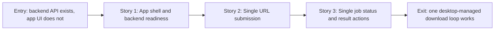

# Story Map: Phase 1 - Desktop App Starts One Download

**Date**: 2026-05-08
**Phase Plan**: `history/windows-desktop-downloader-ui/phase-plan.md`
**Phase Contract**: `history/windows-desktop-downloader-ui/phase-1-contract.md`
**Approach Reference**: `history/windows-desktop-downloader-ui/approach.md`

---

## 1. Story Dependency Diagram

---

## 2. Story Table

| Story | What Happens In This Story | Why Now | Contributes To | Creates | Unlocks | Done Looks Like |
|-------|-----------------------------|---------|----------------|---------|---------|-----------------|
| Story 1: App shell and backend readiness | The app scaffold opens as a Windows desktop utility and owns backend start/health/log readiness. | This must be true before any user download action is believable. | Exit states for desktop shell and managed backend readiness. | Tauri/React scaffold, backend lifecycle command, health state, diagnostics capture. | Story 2 can submit to a ready backend. | App shows starting/ready/error from health checks and does not require manual server startup in the happy path. |
| Story 2: Single URL submission | The Single mode accepts one in-scope URL, applies the current output folder/config, and submits a backend job. | It is the first real user workflow after backend readiness. | Exit states for output folder handoff and job submission. | Typed backend client, single URL form, output folder/session config handoff. | Story 3 can poll a concrete job id. | Submitting one URL returns a job id and moves UI into active job state; tests fake backend behavior. |
| Story 3: Single job status and result actions | The app polls the job, renders friendly status/counts, and exposes open-folder action after terminal state. | It closes the single-download loop and creates reusable status patterns for batch. | Exit states for status/count display, friendly failure, and result action. | Job polling state, status components, error mapping, open-folder command. | Phase 2 batch queue can reuse client/status/action patterns. | Pending/running/success/failed states render correctly and terminal states provide practical next action. |

---

## 3. Story Details

### Story 1: App Shell and Backend Readiness

- **What Happens In This Story**: The wrapper repo becomes a real desktop app project. It can open a desktop window, show a restrained utility layout, start or attach to the managed backend, poll `/api/v1/health`, and keep backend diagnostics separate from the main workflow.
- **Why Now**: D1 and D15 define the product boundary. Without this story, later UI work could accidentally become a localhost web app or depend on a terminal-started backend.
- **Contributes To**: The phase exit state that the desktop app exists and manages backend readiness.
- **Creates**: Tauri/React project scaffold, backend process controller, health-check state machine, diagnostics buffer, basic app layout.
- **Unlocks**: Single URL submission can call a ready backend instead of mocking the whole environment.
- **Done Looks Like**: App startup reaches one of three observable states: starting, ready, or actionable error. Tests cover lifecycle state transitions with a fake backend process/client.
- **Candidate Bead Themes**:
  - Scaffold Tauri/React app and test harness.
  - Implement backend lifecycle/readiness controller.
  - Add diagnostics capture and clean startup error UI.

### Story 2: Single URL Submission

- **What Happens In This Story**: The user can choose or keep an output folder, paste one in-scope Douyin URL, and submit it through a typed backend client. The UI moves into an active job state only when the backend returns a job id.
- **Why Now**: It turns backend readiness into the first real user action while keeping batch and cookie recovery out of the first slice.
- **Contributes To**: The phase exit state that Single mode can submit one URL and honor the current output folder/config.
- **Creates**: Backend API client, URL form, current-session output folder handling, config handoff contract, submit state/error handling.
- **Unlocks**: Job status polling has a real job id and output folder context to track.
- **Done Looks Like**: Tests prove blank/unsupported URL handling, happy-path submit, submit failure, and app state transition to active job without live Douyin calls.
- **Candidate Bead Themes**:
  - Backend client for health/download/job APIs.
  - Output folder and config handoff for Phase 1.
  - Single mode form and submit flow.

### Story 3: Single Job Status and Result Actions

- **What Happens In This Story**: The app polls backend job status until terminal state, shows user-facing status/counts, maps raw backend errors into practical text, and lets the user open the output folder after completion.
- **Why Now**: Starting a download is incomplete unless the user can monitor it and act after success/failure.
- **Contributes To**: The phase exit state that one desktop-managed download loop is observable and usable.
- **Creates**: Polling loop, job status model, count display, friendly error mapper, open-folder command, Phase 1 UAT instructions.
- **Unlocks**: Phase 2 can reuse the same status model for multiple queue rows.
- **Done Looks Like**: Simulated pending/running/success/failed jobs render correctly; terminal job states stop polling and show practical actions.
- **Candidate Bead Themes**:
  - Polling/status/count UI.
  - Friendly failure/result action handling.
  - Phase 1 verification/UAT proof.

---

## 4. Story Order Check

- [x] Story 1 is obviously first.
- [x] Every later story builds on or de-risks an earlier story.
- [x] If every story reaches "Done Looks Like", the phase exit state should be true.

---

## 5. Multi-Perspective Check

Phase 1 contains HIGH-risk sidecar/backend lifecycle work, so planning reviewed the phase before bead creation.

| Check | Result |
|-------|--------|
| Does this phase fit the full feature plan? | Yes. It proves the app/backend boundary that all later single, batch, recovery, and packaging work depend on. |
| Does the contract close a small believable loop? | Yes. It ends with one desktop-managed single download loop and an open-folder action. |
| Do stories make sense in order? | Yes. Backend readiness precedes job submission; job submission precedes status/result handling. |
| Which story is too large or vague? | Story 1 has sidecar risk, so it is split into scaffold and lifecycle beads. Story 2 splits client/config handoff from UI submit flow. |
| What would make an executor regret this design? | If packaging constraints are ignored until Phase 4, sidecar/config decisions could be wrong. Beads include validating-facing evidence around production-compatible lifecycle and mutable config paths. |

---

## 6. Story-To-Bead Mapping

| Story | Beads | Notes |
|-------|-------|-------|
| Story 1: App shell and backend readiness | `douyin-downloader-app-irx.1`, `douyin-downloader-app-irx.2` | Scaffold must precede lifecycle/readiness work because backend state needs a real desktop shell to attach to. |
| Story 2: Single URL submission | `douyin-downloader-app-irx.3`, `douyin-downloader-app-irx.4` | Typed backend client and config/output handoff must precede UI submit integration. |
| Story 3: Single job status and result actions | `douyin-downloader-app-irx.5`, `douyin-downloader-app-irx.6`, `douyin-downloader-app-irx.7` | Polling/status model precedes result actions; final UAT depends on all implementation beads. |
