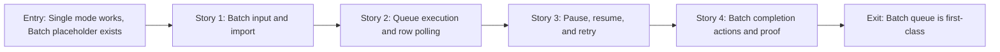

# Phase Contract: Phase 2 - Batch Queue Is First-Class

**Date**: 2026-05-08
**Feature**: windows-desktop-downloader-ui
**Phase Plan Reference**: `history/windows-desktop-downloader-ui/phase-plan.md`
**Based on**:
- `history/windows-desktop-downloader-ui/CONTEXT.md`
- `history/windows-desktop-downloader-ui/discovery.md`
- `history/windows-desktop-downloader-ui/approach.md`
- `history/windows-desktop-downloader-ui/phase-1-contract.md`
- `history/windows-desktop-downloader-ui/phase-1-story-map.md`
- Phase 1 rescue evidence: `history/windows-desktop-downloader-ui/evidence/phase1-tauri-smoke-rescue.json`

---

## 1. What This Phase Changes

After this phase, Batch mode stops being a placeholder. A user can switch to Batch, paste or import many URLs, see each row as a real queue item, start the queue, pause future starts, resume waiting work, retry failed rows, and trust the visible totals for success, failed, and skipped rows.

This phase makes D8 believable without pretending the backend can pause an active download. The truthful first-version semantics are: pause prevents new queued rows from starting, already running backend jobs continue until terminal state, resume starts waiting rows again, and retry resubmits rows that ended failed.

---

## 2. Why This Phase Exists Now

- Phase 1 proved the desktop shell, app-managed backend, single job submission, status polling, and open-folder action.
- D8 locks full batch into the first version; a multiline form alone is not enough.
- Current backend server accepts one URL per job, so the desktop app must own a visible queue model and map queue rows to backend jobs unless validating proves a backend API change is necessary.
- Recovery, history, and logs in Phase 3 should attach to a real queue model instead of being designed around a temporary batch placeholder.

---

## 3. Entry State

- Tauri/React app exists and can run the managed backend in `dev-python` mode.
- Single mode can submit one Douyin URL to `/api/v1/download`, poll `/api/v1/jobs/{job_id}`, and show status/counts/result actions.
- The main screen already has equal-weight Single and Batch tabs, but Batch only renders placeholder text.
- `backendClient.ts` exposes health, create job, get job, and list jobs; it does not expose a batch endpoint.
- The sibling backend `server.jobs.JobManager` supports async single-job submission with concurrency, in-memory state, terminal counts, and no pause/cancel API.
- Phase 1 UAT markdown is stale in places, but the closed `.7` bead and rescue evidence show backend health-ready proof.

---

## 4. Exit State

- Batch mode accepts pasted multiline URLs and imported text-file URLs, turns them into queue rows, and marks unsupported/blank/duplicate rows as skipped or invalid without starting backend jobs for them.
- The user can start a batch queue and see per-row state: waiting, running, success, failed, skipped, and the backend job id when one exists.
- Queue execution submits valid waiting rows through the existing backend client, respects a small app-side concurrency limit, and reuses the Phase 1 polling/status mapping for row updates.
- The UI shows the active URL/job, running count, success/failed/skipped totals, and a clear terminal batch summary.
- Pause/resume semantics are explicit and truthful: pause blocks future starts only; running backend jobs continue; resume starts remaining waiting rows.
- Retry is available for failed rows, resetting selected rows into waiting state and resubmitting them without rebuilding the whole queue.
- Batch completion actions include opening the output folder and enough per-row context for a user to know what succeeded or failed.
- Automated tests cover parsing/import behavior, queue state transitions, pause/resume, retry, aggregate counts, and UI behavior with fake backend clients. No test depends on live Douyin network or cookies.
- UAT evidence proves a fake/backend-driven batch run can start, pause, resume, retry a failed row, finish, and show totals matching rows.

---

## 5. Demo Walkthrough

A user launches the desktop app, waits for backend readiness, switches to Batch, imports or pastes a small URL list, sees valid rows and skipped invalid rows, starts the queue, pauses while one row is running, confirms no new row starts, resumes the queue, retries one failed row, and sees final totals match the row states. The user can then open the selected output folder from the batch completion surface.

### Demo Checklist

- [ ] Batch tab is equal weight with Single and no longer shows placeholder-only content.
- [ ] Paste/import creates visible queue rows with stable row state.
- [ ] Invalid or unsupported rows are shown as skipped/invalid without backend submission.
- [ ] Start submits only valid waiting rows.
- [ ] Active URL/job and aggregate totals update while jobs run.
- [ ] Pause prevents new starts while allowing already running jobs to finish.
- [ ] Resume continues waiting rows.
- [ ] Retry failed rows resubmits only those rows.
- [ ] Completion summary and open-folder action are available after terminal queue state.

---

## 6. Story Sequence At A Glance

| Story | What Happens | Why Now | Unlocks Next | Done Looks Like |
|-------|--------------|---------|---------------|-----------------|
| Story 1: Batch input and import | The user creates a visible queue from pasted or imported URLs, with invalid/skipped rows shown clearly. | There is no queue to run until the app can reliably turn user input into row state. | Queue execution can submit only valid waiting rows. | Batch mode replaces the placeholder; tests prove parsing, dedupe/invalid handling, and import behavior. |
| Story 2: Queue execution and row polling | The app submits valid rows through the single-job API, tracks backend job ids, polls rows, and updates counts. | It turns queue rows into real backend work while reusing Phase 1 job contracts. | Pause/resume/retry can operate on real row states. | Running rows show active URL/job and terminal states update row and aggregate totals. |
| Story 3: Pause, resume, and retry | The user can pause future starts, resume waiting work, and retry failed rows. | D8 specifically requires queue control, and the semantics must be truthful with the current backend. | Batch completion can summarize a controlled queue instead of an uncontrolled loop. | Tests prove pause does not cancel active jobs, resume starts waiting rows, and retry resubmits only eligible rows. |
| Story 4: Batch completion actions and proof | The app summarizes the finished batch and exposes practical output actions with UAT evidence. | It closes the phase with observable user value and validation-ready evidence. | Phase 3 can add recovery, history, and logs to both single and batch flows. | Final totals match rows, open-folder action works, and Phase 2 UAT evidence is written. |

---

## 7. Phase Diagram

---

## 8. Out Of Scope

- Cookie fetch-again flow, manual/import cookie UI, and cookie-expiration recovery are Phase 3.
- Persistent history across app launches is Phase 3.
- Separate Logs tab/panel is Phase 3, beyond diagnostics already present from Phase 1.
- Portable unzip-and-run package proof is Phase 4.
- Active-download pause/cancel is out of scope unless validating proves it is required; Phase 2 pause means "do not start more rows."
- Live, comments, transcript, discovery, search, installer setup, mobile/LAN, and external-backend mode remain deferred.

---

## 9. Success Signals

- A reviewer can run Batch mode without needing a terminal or browser UI.
- Row state and totals are internally consistent after start, pause, resume, retry, success, failure, and skipped input.
- The UI never implies an active backend job was paused or cancelled if the backend kept running.
- Backend changes are avoided unless they are needed for truthful queue behavior.
- Batch tests use fake backend clients and timers so they are deterministic.
- Phase 3 can attach recovery/history/logs to a real queue model.

---

## 10. Failure / Pivot Signals

- The queue runner cannot be tested deterministically without sleeping or live backend calls.
- The current single-job API cannot provide enough row terminal state for a believable batch UI.
- Pause/resume copy or controls imply active downloads can be stopped when the backend cannot do that.
- Retrying failed rows risks duplicate concurrent submissions for the same row.
- Batch UI becomes a dense developer dashboard instead of a clean Windows utility.
- Implementing this phase would touch broad backend downloader internals instead of staying mostly in the app queue layer.

---

## 11. HIGH-Risk Items For Validating

- **Queue semantics over single-job API**: validate that app-side orchestration is enough for D8 before adding backend batch APIs.
- **Pause/resume truthfulness**: validate UI wording and state transitions so users understand pause affects future starts only.
- **Retry idempotence**: validate failed-row retry cannot duplicate in-flight jobs or corrupt aggregate totals.
- **Batch UI density**: validate the queue remains scan-friendly and utility-like as row controls and totals are added.
