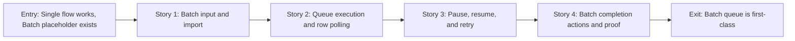

# Story Map: Phase 2 - Batch Queue Is First-Class

**Date**: 2026-05-08
**Phase Plan**: `history/windows-desktop-downloader-ui/phase-plan.md`
**Phase Contract**: `history/windows-desktop-downloader-ui/phase-2-contract.md`
**Approach Reference**: `history/windows-desktop-downloader-ui/approach.md`

---

## 1. Story Dependency Diagram

---

## 2. Story Table

| Story | What Happens In This Story | Why Now | Contributes To | Creates | Unlocks | Done Looks Like |
|-------|-----------------------------|---------|----------------|---------|---------|-----------------|
| Story 1: Batch input and import | Batch mode turns pasted or imported text into visible queue rows with valid, invalid, duplicate, and skipped states. | Queue execution should only start after input becomes explicit row state. | Exit states for batch input, import, validation, and skipped rows. | Batch parser/model, import adapter, Batch panel, queue table shell. | Story 2 can submit valid waiting rows. | Tests prove parsing/import/validation and UI shows rows instead of a placeholder. |
| Story 2: Queue execution and row polling | Valid waiting rows are submitted through the backend client, receive job ids, poll job status, and update row/aggregate state. | This is the first real batch work after rows exist. | Exit states for backend mapping, active URL/job, row states, counts. | Queue runner, row pollers, concurrency control, aggregate counters. | Story 3 can control a real queue. | Fake backend tests prove start, concurrency, running/success/failed transitions, and totals. |
| Story 3: Pause, resume, and retry | The user can pause future starts, resume waiting rows, and retry failed/skipped rows. | D8 requires meaningful queue controls, and they must be honest about backend limitations. | Exit states for pause/resume/retry and retry-safe state transitions. | Control state machine, retry eligibility, UI buttons, guardrails against duplicate in-flight jobs. | Story 4 can summarize a controlled queue. | Tests prove pause does not cancel active jobs, resume continues waiting work, and retry only resubmits eligible rows. |
| Story 4: Batch completion actions and proof | The app shows terminal batch summary, practical output actions, and written UAT evidence. | A phase is not done until the user can tell what happened and reviewers can verify it. | Exit states for completion summary, output action, and validation-ready evidence. | Batch summary surface, output action reuse, Phase 2 UAT artifact. | Phase 3 can add recovery, history, and logs across single and batch. | Final totals match rows, open folder works, tests/build pass, and UAT evidence documents start/pause/resume/retry. |

---

## 3. Story Details

### Story 1: Batch Input and Import

- **What Happens In This Story**: Batch mode replaces the placeholder with controls for pasted multiline URLs and text-file import. The app creates stable queue rows, validates Douyin/iesdouyin hosts, treats blank lines safely, and marks unsupported or duplicate inputs without submitting them.
- **Why Now**: A queue runner should not parse raw textarea text while it is also starting jobs. Explicit row state makes later execution, pause, retry, and totals predictable.
- **Contributes To**: The phase exit state that users can import/paste many URLs and see a queue before starting.
- **Creates**: Batch queue parser/model, row ids, row status vocabulary, import adapter boundary, initial queue table UI, parser/UI tests.
- **Unlocks**: Queue execution can operate on valid waiting rows only.
- **Done Looks Like**: Given pasted or imported text, the UI shows rows with clear statuses and does not call the backend yet.
- **Candidate Bead Themes**:
  - Queue parser/model and import behavior.
  - Batch panel and queue table shell.

### Story 2: Queue Execution and Row Polling

- **What Happens In This Story**: The queue runner submits valid waiting rows through `BackendClient.createDownloadJob`, records backend job ids, polls each row with the existing job contract, and updates row state plus aggregate totals.
- **Why Now**: Batch value starts when multiple rows become real backend work. Reusing Phase 1 client/polling keeps the blast radius smaller than adding a backend batch API immediately.
- **Contributes To**: The phase exit state that active URL/job and success/failed/skipped totals are visible during batch execution.
- **Creates**: Batch queue runner, concurrency guard, per-row polling, aggregate selector/helpers, execution UI wiring.
- **Unlocks**: Pause/resume/retry controls can operate on real waiting/running/terminal row states.
- **Done Looks Like**: Fake backend tests show rows moving waiting -> running -> success/failed, with totals matching row states.
- **Candidate Bead Themes**:
  - Deterministic queue runner service.
  - Execution UI wiring and count rendering.

### Story 3: Pause, Resume, and Retry

- **What Happens In This Story**: Pause changes the queue into a state where no new waiting row starts, while active backend jobs keep polling to terminal state. Resume restarts the scheduler for waiting rows. Retry resets failed or skipped rows into waiting state and resubmits them only when they are not already in-flight.
- **Why Now**: D8 explicitly asks for pause/resume and retry per job. The app must make these controls useful without overstating backend capabilities.
- **Contributes To**: The phase exit state that users can control a batch queue after it starts.
- **Creates**: Queue control commands, retry eligibility rules, UI state for disabled/active controls, duplicate-submit prevention.
- **Unlocks**: Batch completion can summarize a queue that the user actually controlled.
- **Done Looks Like**: Tests prove pause, resume, and retry behavior at both service and UI level, including active jobs continuing after pause.
- **Candidate Bead Themes**:
  - Pause/resume state machine.
  - Retry failed/skipped rows safely.

### Story 4: Batch Completion Actions and Proof

- **What Happens In This Story**: The batch surface shows final totals and practical actions after the queue reaches terminal state. The phase closes with automated test logs, build proof, and a short UAT artifact showing start/pause/resume/retry behavior.
- **Why Now**: The user needs a clear end state, and validating/reviewing need evidence that the phase is real.
- **Contributes To**: The phase exit state that batch is a usable first-class workflow.
- **Creates**: Completion summary, output-folder action reuse, Phase 2 UAT evidence file.
- **Unlocks**: Phase 3 recovery/history/logs can attach to the same row model and terminal state.
- **Done Looks Like**: Final totals match rows; output-folder action works from the batch surface; tests/build/UAT evidence are recorded.
- **Candidate Bead Themes**:
  - Batch completion and actions.
  - Phase 2 verification/UAT proof.

---

## 4. Story Order Check

- [x] Story 1 is obviously first.
- [x] Every later story builds on or de-risks an earlier story.
- [x] If every story reaches "Done Looks Like", the phase exit state should be true.

---

## 5. Multi-Perspective Check

Phase 2 contains HIGH-risk batch semantics over a single-job backend API, so planning reviewed the phase before bead creation.

| Check | Result |
|-------|--------|
| Does this phase fit the full feature plan? | Yes. It turns D8 from a requirement into a real user workflow before Phase 3 adds recovery/history/logs. |
| Does the contract close a small believable loop? | Yes. It ends with a user-visible batch queue that can start, pause, resume, retry, summarize, and open output. |
| Do stories make sense in order? | Yes. Row creation precedes execution; execution precedes controls; controls precede completion proof. |
| Which story is too large or vague? | Story 2 has the most risk, so bead decomposition separates service-level queue execution from UI wiring. |
| What would make an executor regret this design? | If "pause" is implemented as active job cancellation without backend support. Beads must preserve "pause future starts only" unless validating explicitly changes the contract. |

---

## 6. Story-To-Bead Mapping

| Story | Beads | Notes |
|-------|-------|-------|
| Story 1: Batch input and import | `douyin-downloader-app-irx.8`, `douyin-downloader-app-irx.9` | Model/parser comes before UI so validation and skipped-row semantics are testable outside React. |
| Story 2: Queue execution and row polling | `douyin-downloader-app-irx.10`, `douyin-downloader-app-irx.11` | Service-level runner comes before full UI execution wiring. |
| Story 3: Pause, resume, and retry | `douyin-downloader-app-irx.12` | This bead depends on execution wiring so controls operate on real row states. |
| Story 4: Batch completion actions and proof | `douyin-downloader-app-irx.13`, `douyin-downloader-app-irx.14` | Completion UI precedes UAT proof; proof depends on all implementation beads. |

---

## 7. Validation Spike Constraints

Validation spikes completed during `khuym:validating` answered the Phase 2 HIGH-risk questions with **YES, with constraints**. Execution beads must preserve these constraints:

- App-owned queue orchestration is sufficient for Phase 2. Do not add a backend batch API unless execution proves the existing `createDownloadJob` / `getJob` contract cannot produce terminal row state.
- Queue state is authoritative in the app. Backend jobs are in-memory and single-job oriented, so row status, retry eligibility, and aggregate totals must be derived from current app row state.
- Pause means "pause new starts" only. Running backend jobs continue polling to success or failure; UI copy and tests must not imply active job cancellation.
- Retry applies only to eligible terminal failed/skipped rows. It must synchronously lock/reset rows before async submission so double-clicks or scheduler ticks cannot create duplicate in-flight jobs.
- Aggregate totals must be recomputed from current row states after retry resets. A row that fails, is retried, and succeeds should count as one success in the final batch summary.
- Batch UI must stay one bounded workflow: paste/import input, compact toolbar, one totals strip, queue rows, and terminal summary. Row controls are conditional; raw diagnostics stay out of the main queue table.
